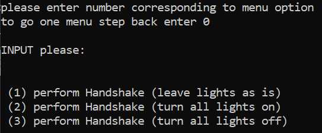
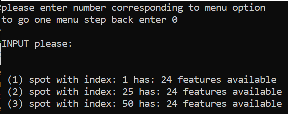
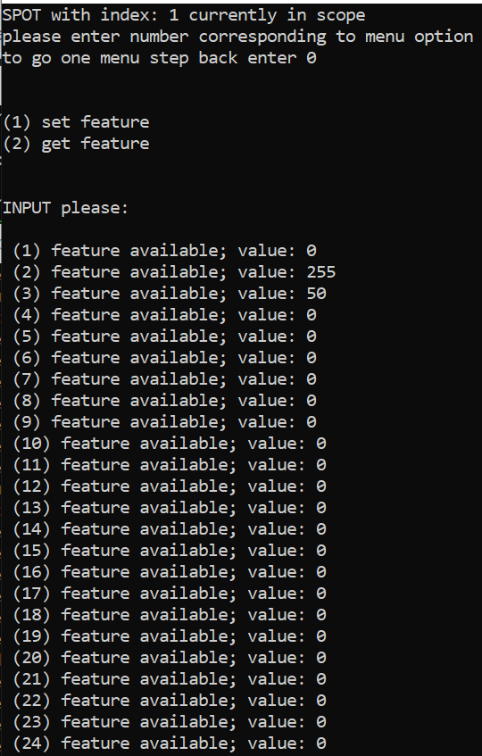
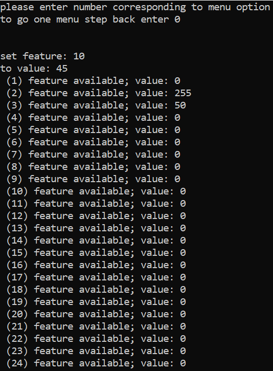
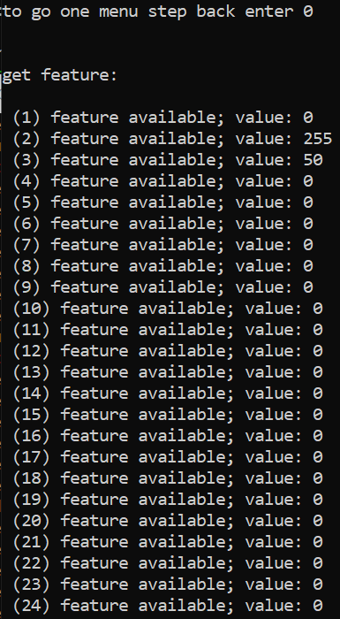

# How to start the application
1. clone the repo to dir of your choice
2. from the commandline switch to the "Debug" folder
- start the server by entering "start server"
- start the client by entering "start client localhost"
  - NOTE: instead of localhost, you could also choose a valid IP that your server runs on
  
# How to run the application
## Serverside
- you need to configure the "DMX_CONFIG.txt" file to match the connected DMX resources
  - The file has the following format:
```
<NO of available spots>
<Index-Spot0> <Feature-Count-Spot0>
<Index-Spot1> <Feature-Count-Spot1>
...
```
- the serverside displayes a log feed of the actions and communication steps that took place.
- Dont be concerned with that, it is just used as a Debug/Info Log

## Client Side
- On the client side you have a rudermentary comandlien Interface to talk to the server.
- The Interface consists of multiple menues that you can orient between by entering the resepctive numbers.
  - To go one menu back simply enter 0
### Start Menu
- You have 3 option on how you would like to perform the handshake with the server.
<p align="center">

</p>


### Select Spot Menu
- In this menu, you can select which of the spots you would like to "interact" with
<p align="center">

</p>

### Single Spot Menu
- in this mennu, you cann see all the features of the selected spot.
- furthermore you are able to set a feature or request(get) the value of a feature from the server.
<p align="center">

</p>

### Set Feature
- first you need to enter the number of the feature you would like to set, and hit enter.
- you then need to enter the value you would like the feature to be set with.
<p align="center">

</p>

### Get Feature
- you need to enter the number of the feature you would like to request its value from the server.
<p align="center">

</p>

## Understanding the application
### Data
- the client and the server both create a datastructure that holds information on all the available spots and the values of their features.
- upon performing the handshake these structures might get set to all 1, all 0 or left as is (only on the server side)
- If the client or the server terminates the value information of the features is lost.
  - If only the client terminates, but the server remains running, the client can select the "perform Handshake (leave lights as is)" option to not override the data on the server. He can then follow up by requesting the values of all the features he is interested in, to relearn about their value.


### Connection
In case the connection is lost, the server and the client react in differnt ways:
| Role | Reaction |
| :-:  | :-:      |
| Server| Keeps runing, waits for new connection |
| Client| Terminates |


Current Implementation:
Commands:
-> Client to Server
  -) Handshake   [CMD] [ARG]
  -) Set Feature [CMD] [spotIndex] [featureIndex] [new_value]
  -) Get Feature [CMD] [spotIndex] [featureIndex]
-> Server to Client
  ..server echos sent command as first byte of message
  ..second byte of reply is errorcode (success or failure)
  ..every byte after that holds information in refference to command sent by the client
 
 Memory:
 -> Server learns about available spots (their DMX channel number and the number of available features) through a textfile called
    "DMX_CONFIG.txt" that resides in the same folder as the executable (DEBUG folder)
 -> Server has data structure that tracks the values of all of the features that are set (only gets eradicated when the server shuts down)
 

What still needs to be done:
1) implementiere die Ansteuerung der Leuchten per DMX ->insdie ServerCallback.cpp
2) rewrite RFC document
(~not really neccessary: 3) make User Interface more beautifull)

# start the program
...

Commands:
NOTE: all message are \0 delimitered
# Handshake
Client to Server
    [0x01] [0x01] (Request Handshake + turn all lights off)
    [0x01] [0x02] (Request Handshake + turn all lights on)
    [0x01] [0x03] (Request Handshake + leave lights in current state)
Server Reply
    [0x01] [0xBF] [No of Spot-Feature Pairs] [var No of Spot-Feature Pairs] [\0] (echod command + sent error code that all went well)
    [0x01] [0xEA] (echod command + sent error code that command is unknown)
    [0x01] [0xEB] (echod command + sent error code that argument is unknown)
    [0x01] [0xFF] (echod command + sent all went wrong error code ->is sent when something went wrong, but none of the
                   two above errocodes applys)
# Set feature value
Client to Server
    [0x03] [spotIndex] [featureIndex] [new_value] (Request to set new feature + provides server with neccessary info)
Server Reply
    [0x03] [0xBF] (echod command + sent error code that all went well)
    [0x03] [0xEA] (echod command + sent error code that command is unknown)
    [0x03] [0xEB] (echod command + sent error code that argument is unknown)
    [0x03] [0xFF] (echod command + sent all went wrong erro code ->is sent when something went wrong, but none of the
                   two above errocodes applys)
                   
# Get feature value
Client to Server
    [0x02] [spotIndex] [featureIndex] (Request to set new feature + provides server with neccessary info)
Server Reply
    [0x02] [0xBF] [spotIndex] [featureIndex] [requested_value] [\0] (echod command + sent error code that all went well + provides client with neccessary info)
    [0x02] [0xEA] (echod command + sent error code that command is unknown)
    [0x02] [0xEB] (echod command + sent error code that argument is unknown)
    [0x02] [0xFF] (echod command + sent all went wrong erro code ->is sent when something went wrong, but none of the
                   two above errocodes applys)
